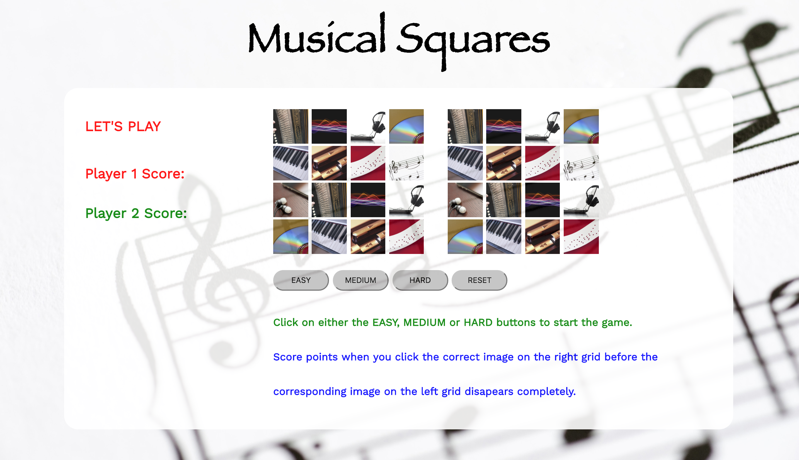
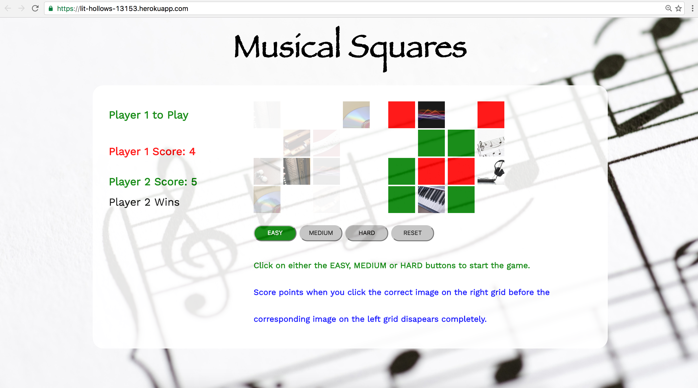

# End of Module 1 Project.

GA WDI-idn-23 integer Project One. created by John Evans release 1.0 12 October 2016.

# Musical Squares

Play the game [here](https://lit-hollows-13153.herokuapp.com/)

### Objectives

- Create an interactive game in the browser using the tools and techniques learnt in module 1 of the WDI-23.
- Use of HTML, CSS, Javascript JQuery and running code from the CLI.
- Complete planning activities including wireframe, project planning, code development, debugging and testing
- Manage the effect use of commit and push work in progress solutions to GitHub and Heroku.
- Deploy final solution to Heroku for presentation.
- Complete 5 minute presentation to GA team and peers.
- Presentation to cover demonstration of game, a review of key aspects of code and feedback on experiences and lessons learnt during planning and delivery as well as potential areas for further development.

### Technology Used
* Javascript
* jQuery
* HMTL5
* CSS3
* Heroku
* git
* CLI

### Project Feedback + Evaluation
Focusing on completing a list of Must haves and Should haves at the outset of the project and working to complete small modules of the project as the overall solution evolves was a key learning point to be taken forward. I was able to addapt to the use of JQuery that help me to more effectly realise some of the key functionality delivered in the solution which was proving to be more difficult to realise in JavaScript.

### Preparation

Use the information taught in module 1.

First project to create a game in order to develop an improved understanding of the approach required to create and deploy for general use a viable working web based game.

Musical Squares is a 1 or 2 player game that tests the visual and auditory response times of users.

There is potential for application within the medical arena to measure an individuals capacity to respond to visual and auditory stimuation and abliity to concentrate over a short time period.

A random grid of images and sounds are presented to the players with the aim of capturing a square that is the process of being removed from the grid.

The game has 3 levels of easy, medium and hard with corresponding reductions in reaction times at 5 seconds, 3 seconds and 1 second.

The player with the most captured images of the 8 possible turns each; wins. As a 1 player game the user would play against the board with the aim of capturing as many squares as possible.

Instructions for playing the game: Click on either the EASY, MEDIUM or HARD buttons to start the game. Click RESET to restart.

Take turns to click on the image on the right hand grid before the corresponding image and sound. disapears on the left hand grid. Score points when you correctly click the correct image on the right before the image on the left disapears completely.

If you click on the wrong image it will be removed from the grid and you will lose your turn.

###The Steps taken

Initial planning using Trello, timeline, wireframes, developing game concept and gameplay rules, technology to use, code tests, functionality tests and uploading.

###Challenges faced

- Translating the concept into a workable solution, using the knowledge gained during the 2 weeks on the course.
- Understanding enough jQuery and Javascript to get the job done within the required deadline.
- Getting css and html to display the game with styling and features as intended. 

###Where to from here?
The game could be improved in the following ways:

* Convert the Javascript and JQuery code over to ES6 code and an Object Oriented solution.
* Improve styling to make the game more eye catching.
* Adding a timer for reaction for each player and overall timer for the game play.
* Adding on more challenges and levels.
* Add options for 3x3 and 5x5 game boards.
* Investigate indroducing responsiveness to allow game to be played on smaller screen formats.

###Bugs/Issues
- Computer may at times freeze part way through the game.
- Investigate size of image files and reduce to improve responsiveness 

